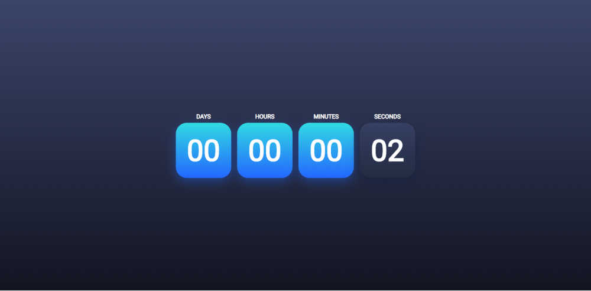

# New Year Countdown 2020 | HTML, CSS & JavaScript
Hi ! this the first code on my youtube chanel.

Star⭐ the repo and subscribe on my youtube chanel if you like what you see😉.

## 📸  ScreenShots

## ✨ Requirements
* Any Operating System (ie. MacOS X, Linux, Windows)
* Any IDE (I use VSCode)
* A little knowledge of HTML, CSS, JavaScript
* [GSAP](https://greensock.com/gsap/) (JavaScript animation for the modern web)
* A brain to think 🤓🤓

## 🤓 Author(s)
**Piyawat Supasri**